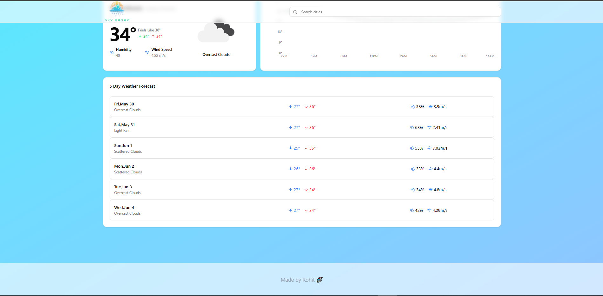

# Sky Radar

*Company*: CODETECH IT SOLUTIONS

*Name*: Rohit Kumar

*Intern ID*: CT12WC98

*Domain*: Mern Stack Web Development

*Duration*: 12 weeks

*Mentor*: Neela Santosh

Sky Radar is an innovative weather application built with React that seamlessly integrates geolocation features to provide users with accurate and timely weather information. The application boasts a user-friendly interface, offering essential details like temperature, humidity, wind speed, and overall conditions. Additionally, it presents a comprehensive hourly temperature chart and a 5-day weather forecast to help users plan ahead. The city search functionality enhances usability, while the responsive design caters to various devices, offering both light and dark themes for personal preference. Utilizing modern technologies such as React 18, Vite, and Tailwind CSS, along with powerful tools like React Query for data fetching and Sonner for notifications, Sky Radar ensures a smooth and visually appealing experience for all users.



## Features

- Current weather details including temperature, humidity, wind speed, and conditions.
- Hourly temperature chart.
- 5-day weather forecast.
- City search functionality.
- Responsive design with light and dark themes.

## Getting Started

### Prerequisites

- Node.js (v16 or higher recommended)
- npm (comes with Node.js)

### Installation

1. Clone the repository:

```bash
git clone <repository-url>
cd sky_radar
```

2. Install dependencies:

```bash
npm install
```

### Running the Application

Start the development server:

```bash
npm run dev
```

Open your browser and navigate to `http://localhost:3000` (or the port shown in the terminal) to view the app.

### Building for Production

To build the app for production:

```bash
npm run build
```


## Technologies Used

- React 18
- Vite
- Tailwind CSS
- React Query
- React Router
- Sonner (for notifications)
- Lucide React (icons)

---

Made by Rohit 🐱‍🏍
